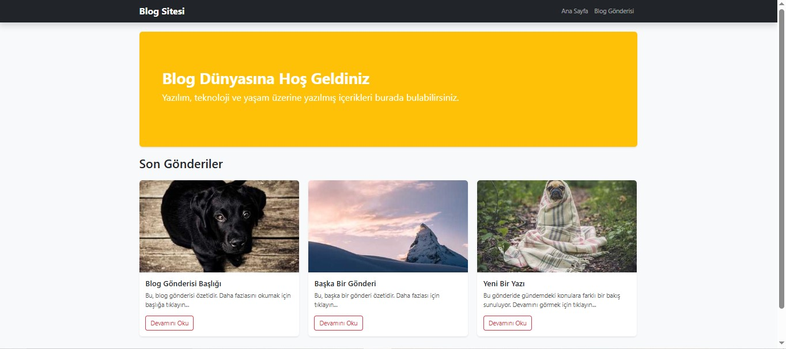
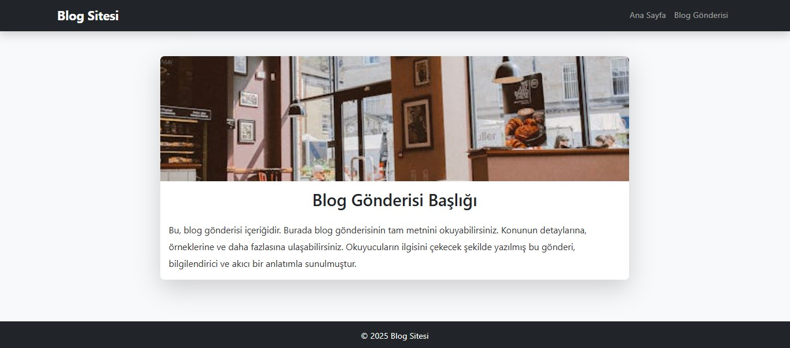

# 📝 Bootstrap Blog Sitesi

Bu proje, HTML ve Bootstrap kullanılarak oluşturulmuş basit bir blog sitesi tasarımıdır.  
Frontend temel bilgileriyle geliştirilen bu proje, sayfa düzeni, grid sistemi, kart yapıları ve responsive (mobil uyumlu) tasarım gibi konuları içermektedir.

---

## 📌 Projede Neler Var?

- ✅ **Ana Sayfa (`index.html`)**
  - Koyu temalı üst menü (Navbar)
  - Jumbotron (Hoş geldiniz alanı)
  - 3 adet blog gönderisi (Card yapısında)
  - Responsive grid yapısı (mobil uyumlu)

- ✅ **Detay Sayfası (`post.html`)**
  - Büyük görsel alanı
  - Blog başlığı ve metin içeriği
  - Sabit alt bilgi (footer en altta kalır)

- ✅ **Stil Dosyası (`style.css`)**
  - Kartlara hover efekti
  - Görseller için yüksekliği sabit ayarlama
  - Mobil görünüm için düzenlemeler
  - Footer'ın sabit altta kalmasını sağlama

---

## 🛠 Kullanılan Teknolojiler

- HTML5
- CSS3
- [Bootstrap 5](https://getbootstrap.com/)
- Mobil uyumlu (responsive) tasarım

---

## 🖼️ Sayfa Görselleri

### 🔹 Ana Sayfa

### 🔹 Blog Gönderisi Sayfası

